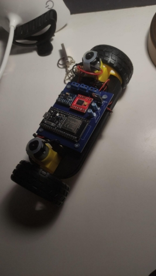

# PenduloInvertido_Cecilia
En este repositorio se encuentra tanto la práctica 4 cómo la práctica 6 de la asignatura de Teoría de Control 

**PRÁCTICA 4 - PID en tiempo discreto** 

Esta práctica tiene como objetivo implementar una biblioteca de controladores PID en tiempo discreto para ser utilizada en un microcontrolador ESP32, con aplicación directa en el control de un péndulo invertido. Esta biblioteca será utilizada en el desarrollo del proyecto de control descrito en el capítulo 6 del guión de prácticas. 

Se desarrollarán tres variantes del controlador PID en tiempo discreto: 

- **PID** : utiliza aproximaciones hacia atrás para las derivadas y sumas acumulativas para la integral. 
- **PID como filtro IIR**: modelado mediante transformada Z, facilitando su implementación como filtro digital. 
- **PID filtro baja** : se le pone un filtro al término derivativo para evitar que el ruido o los cambios bruscos del error afecten al control. 

Cada implementación está basada en los pseudocódigos del guión.  

Esta práctica está encapsulada en la carpeta libraries donde nos encontraremos :  

**I2Cdev/** 

Contiene archivos fuente y cabeceras que permiten la comunicación mediante el protocolo I2C. Es una biblioteca comúnmente usada para facilitar la lectura y escritura con sensores como el MPU6050 

**MPU6050/** 

Incluye las definiciones y funciones específicas para el sensor MPU6050, que proporciona mediciones de aceleración y giroscopio. Esta biblioteca se apoya en I2Cdev para obtener los datos del sensor y es esencial para calcular la posición y velocidad angular del péndulo. 

**PIDController/** 

Es la biblioteca desarrollada para está práctica para implementar los tres tipos de controladores PID discretos: 

- PID directo 
- PID como filtro IIR 
- PID filtro pasa baja

Dentro de cada carpeta estarán los archivos .h y .cpp con la implementación de las clases PID 

Se añadirá además una carpeta examples que contendrá tres ejemplos simples que muestran cómo usar cada una de las variantes del controlador PID implementadas. 

**CodigoCompletoPendulo.ino** 

Este es el sketch código principal de Arduino que integra las bibliotecas anteriores. Aquí se encuentra el código de control que: 

- Lee el ángulo del péndulo usando el MPU6050 
- Calcula la señal de control con el PID 
- Aplica la corrección al actuador 
- Permite probar y comparar las distintas variantes del controlador PID 

**PRÁCTICA 6 - Péndulo Invertido** 

En esta memoria se documenta el desarrollo de un prototipo funcional de un sistema de control para un péndulo invertido sobre ruedas, utilizando una ESP32 como unidad de control. El objetivo principal es mantener el equilibrio del péndulo en posición vertical mediante un controlador PID. 

Metodología seguida 

**Revisión de trabajos previos** 

Se investigaron diferentes proyectos relacionados con el péndulo invertido. 

**Definición de objetivos** 

Los objetivos del sistema se centraron en la estabilidad, la capacidad de recuperación tras perturbaciones y la interacción con el usuario mediante mando Bluetooth. 

**Selección del hardware** 

Se eligieron componentes accesibles y económicos que permitan un montaje sencillo y una buena integración con el entorno de desarrollo en C++. 

**Diseño del sistema físico** 

El chasis se diseñó buscando una estructura equilibrada, estable y lo más ligera posible, para facilitar la respuesta del sistema. 

**Programación y pruebas de control PID** 

Se implementó un controlador PID discreto en la ESP32, aplicando distintas versiones del algoritmo (con y sin filtro derivativo) y ajustando sus constantes. 
# **6.1 Hardware**   
**ESP32** 

Como unidad central de procesamiento utilicé una placa ESP32, concretamente un modelo disponible en Amazon por unos 11€. Este microcontrolador se conecta al ordenador mediante USB y permite cargar el código desde el entorno de Arduino.  

**MPU-6050** 

El sensor MPU-6050 fue el elegido para medir la orientación del robot, ya que incorpora un acelerómetro y un giroscopio en un solo módulo. Esta información es clave para mantener el equilibrio, especialmente con un margen inferior a 5 grados de inclinación.  

**Condensadores** 

En el circuito se añadieron dos condensadores: uno de 0,1 µF y otro de 0,22 µF. Estos se usaron para estabilizar la señal y reducir el ruido en ciertas conexiones críticas del sistema. 

**Bloques terminales** 

Para facilitar la conexión entre la batería y los motores, se instalaron bloques terminales. Esto permite una conexión firme y organizada del cableado. Se usaron tres en total, uno para cada motor y otro para la alimentación principal. 

**TB6612FNG** 

Para el control de los motores se optó por el TB6612FNG, un driver más eficiente y moderno que el clásico puente H. Con un precio inferior a los 2€, permite controlar dos motores de forma simultánea e independiente.  

**Batería** 

Alimenté el sistema con un portapilas de 4 pilas AA, conectado directamente a los bornes de alimentación de la placa. 

**Motores y ruedas** 

Se emplearon motores DC con reductora, muy comunes en robótica educativa. Vienen acompañados de ruedas compatibles que se acoplan directamente al eje del motor, facilitando el montaje. 

**Regulador de voltaje** 

Para asegurar un suministro eléctrico estable, se incorporó un regulador LM7805. Este componente mantiene la tensión en 5V, protegiendo así los elementos sensibles del circuito.  

# 6.2 PCB 
Se diseñó una placa PCB que permitiera  integrar todos los componentes del sistema de forma ordenada y funcional. El objetivo principal fue lograr un diseño limpio y claro, con un enrutado de pistas sencillo que permita identificar fácilmente las conexiones entre pines, lo cual es fundamental a la hora de soldar los componentes con precisión y sin errores. 

También se prestó especial atención al tamaño de la placa, tratando de mantener unas dimensiones reducidas. Esto facilita el montaje dentro del chasis del robot y evita que el conjunto final sea demasiado voluminoso, lo que podría afectar al equilibrio o la estética del prototipo. 

**6.3 Diseño Chasis** 

Uno de los aspectos clave en el rendimiento del péndulo invertido es la ubicación del centro de gravedad. Es esencial que esté lo más próximo posible al suelo, ya que un centro de gravedad alto dificulta seriamente la estabilidad del sistema. Además, también es importante que el peso esté bien distribuido y centrado respecto al eje de las ruedas. Si el robot está equilibrado por diseño, se mantendrá en posición vertical incluso estando apagado, lo que facilita en gran medida el ajuste del controlador PID más adelante. 

Este fue el diseño que hice en FreeCad donde monté el péndulo. 

Le añadí agujeros para poder fijar la PCB con tornillos y también unas elevaciones en los lados para sujetar los motores en vertical. Este diseño ya se adapta perfectamente a todo lo que necesitaba, así que fue el que usé para imprimir en 3D. 

El proceso de impresión a pesar de ser sencillo dió algún problema a la hora de imprimir por material atascado y otras complicaciones pero finalmente después de unas 5 horas se imprimió. 

**6.4 Diseño Chasis**

El proceso de montaje es bastante directo: simplemente hay que seguir el diseño de la PCB y conectar cada componente en su sitio. Los sensores se conectan tal como se planificó, sin necesidad de hacer cambios extra. 

Uno de los puntos clave es la alimentación eléctrica, ya que los motores y la ESP32 funcionan con voltajes diferentes. Para evitar problemas, es necesario usar un regulador de voltaje. En mi caso, los motores van con 9V, mientras que la ESP32 se alimenta con 5V, utilizando su pin de 5V directamente. 
# **6.5 Ajuste del PID** 
Para que el robot se mantenga en equilibrio, es necesario ajustar correctamente los valores del controlador PID. Cada una de sus tres partes tiene un efecto distinto sobre el comportamiento del sistema, así que es importante entender bien cómo funciona cada una. 

Orden sugerido para ajustar 

Primero se ajusta Kp: Este valor es el que permite que el robot empiece a reaccionar y trate de levantarse. Se sube poco a poco hasta que se vea que el robot intenta mantenerse en pie. Una vez encontrado un valor útil, se anota y se deja en 0 para pasar al siguiente paso. 

Después se trabaja con Kd: Esta parte se encarga de suavizar el movimiento y reducir las oscilaciones. Se busca un valor con el que el robot no se mueva bruscamente y casi logre mantenerse estable. 

Ahora se vuelve a poner Kp en el valor anotado anteriormente y se deja Kd como está. En esta fase, Ki aún sigue en 0, ya que solo se ajusta si el robot no termina de mantenerse en su sitio. 

Finalmente, se ajusta Ki: Esta constante ayuda a corregir pequeños errores residuales y que el robot alcance con más precisión la posición vertical. Pero si Kp y Kd no están bien ajustados, Ki no va a hacer milagros. 
# **Problemas**  
Durante la fase final del proyecto al intentar cargar el programa final en la ESP32 desde el entorno de Arduino empecé a tener varios problemas de conexión. Aunque conseguí que el ordenador la reconociera todo apuntaba a que el propio componente podría estar defectuoso. 

El error que aparecía de forma visible  era que el pin G0 debía estar en modo programación, así que pensé que podía tratarse de un fallo en el diseño de la PCB. Intenté forzar el estado del pin conectándolo a tierra mediante un puente, pero el mensaje de error seguía apareciendo. 

Tras comprobar con el multímetro que todos los valores eran correctos y que no había cortocircuitos evidentes, decidí aislar la ESP32 para comprobar si el fallo venía realmente de la placa o si el problema estaba en el circuito. 

Tenía dos opciones: cortar las pistas conectadas a la ESP32 (opción que me proporcionó el profesor Enrique) o desoldarla completamente. Al final opté por desoldarla, y aunque fue un proceso lento y delicado finalmente lo conseguí. Al probar la placa por separado verifiqué que estaba defectuosa. 

Elegí esta opción porque de esta forma lo único que tendría que cambiar a futuro sería el componente y no estropeo así la placa. 

Por falta de tiempo no he podido conseguir otra unidad así que el proyecto quedó interrumpido en esa etapa. 
